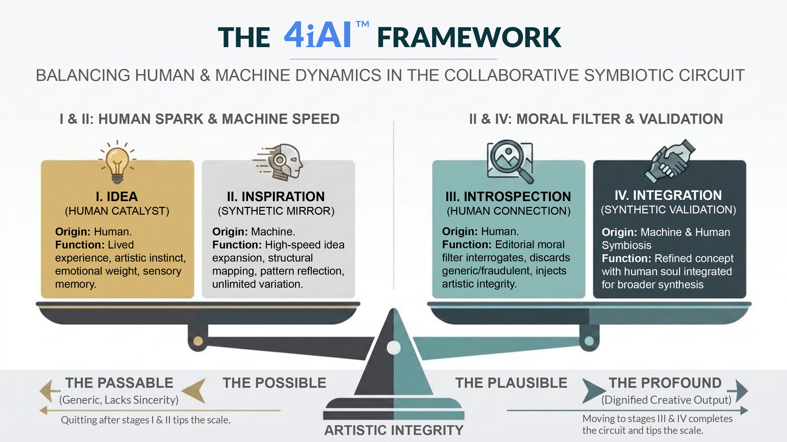

---

title: "CLINICAL & OPERATIONAL MONOGRAPH"

subtitle: "Neuro-Somatic Hardware Integration in Twice-Exceptional (2e) Systems: The Asymmetry-Symmetry Paradox as a Medical-Grade Specification for the 4iAI™ Stage IV Circuit"

author: "Tim Seymour, CGMA, ACMA"

date: "2026-08-09"

description: "High-Capacity / Twice-Exceptional (2e) Adult Hardware Regulation & Burnout Interception"

tags: [twice-exceptional, 2e, human-ai, executive-strategy, talent-management, workflow-optimization, knowledge-workers, cognitive-engineering, operational-efficiency, cybernetic-hci, real-time-synthesis, cns-override, human-ai-symbiosis]

---

# **CLINICAL \& OPERATIONAL MONOGRAPH**

**Title:** Neuro-Somatic Hardware Integration in Twice-Exceptional (2e) Systems: The Asymmetry-Symmetry Paradox as a Medical-Grade Specification for the 4iAI™ Stage IV Circuit

**Author:** Tim Seymour, CGMA, ACMA

**Domain:** Neuro-Somatic Biology, Cybernetic Systems Engineering, Clinical Metabolic Architecture

**Subject Classification:** High-Capacity / Twice-Exceptional (2e) Adult Hardware Regulation \& Burnout Interception

**Foundational Protocol:** [The 4iAI™ Framework Monograph](README.md) & [Master Dossier: The Architecture of Asymmetry](MASTER_DOSSIER.md)

## **ABSTRACT**

In high-capacity, twice-exceptional (2e) adult profiles, cognitive architecture operates at elevated processing frequencies, leveraging complex multi-dimensional pattern matching to maintain dopaminergic baseline homeostasis.

This paper establishes **The Asymmetry-Symmetry Paradox** as the primary governing mechanic of the neurodivergent engine: **An asymmetrical mind is perpetually, intrinsically compelled to seek absolute symmetry, structure, and equilibrium across every discipline to balance, anchor, and "fix" its own internal friction.** Because this architecture cannot tolerate structural imbalance within its operational field, leaving physical fitness, somatic regulation, and biological maintenance uncalibrated represents an unacceptable systemic failure mode. It creates a lethal divergence between high-voltage cognitive software and neglected, static hardware.

Standard medical and workplace literature routinely misinterprets the resulting behavioural patterns—monomaniacal hyper-focus followed by severe hypoarousal crashes—as treatment-resistant mood disorders or primary executive dysfunction. In reality, these crashes occur when an asymmetrical processing engine attempts to force symmetry through recursive cognitive loops alone, rapidly depleting its biological substrate.

By integrating high-load mechanical resistance training and Medical Nutrition Therapy (MNT) directly into **Stage IV (Integration)** of the 4iAI™ cybernetic circuit, we prove that physical movement and nutrient timing are not optional lifestyle choices or aesthetic hobbies. They are non-negotiable biological hardware specifications required to satisfy the mind's demand for total symmetry, ground the central nervous system, regulate monoamine tone, clear neuro-glial inflammation, and sustain high-voltage creative and strategic output without systemic collapse.

###### **THE ASYMMETRY-SYMMETRY PARADOX IN THE 4iAI™ SYMBIOTIC CIRCUIT:**

|INTERNAL ARCHITECTURE (ASYMMETRICAL)||PERPETUAL SYSTEMIC DRIVE (SYMMETRICAL)|
|-|-|-|
|• Asynchronous development • Spiky cognitive profile • High-voltage processing engine|→|Construction of rigid frameworks, precise protocols, \& total hardware calibration to balance the engine|
|||↓|
|STAGE II: INSPIRATION Origin: Machine (Mirror) High-speed Structural Mapping|←|STAGE I: IDEA Origin: Human (Spark) Unstructured Cognitive Output|
|↓|||
|STAGE III: INTROSPECT Origin: Human (Moral Filter) Moral Audit \& Emotional Veto|→|STAGE IV: INTEGRATION Origin: Machine \& Human Hardware \& Software Lock|
|||↓|

|HARDWARE TIER: NEURO-SOMATIC ANCHORING (TOTAL SYSTEMIC SYMMETRY) • Mechanical CNS Override (Heavy Resistance / Endocrine Flush) • MNT Bioavailability \& Glymphatic Clearance • Systemic Dopaminergic Baseline Stabilisation  • Complete Somatic Parity (Eliminating Hardware/Software Divergence)|
|-|

## **SECTION 1: The Bio-Mechanical Failure Mode \& The Asymmetry-Symmetry Paradox**

### **1.1 The Core Thesis: The Asymmetry-Symmetry Paradox**

The fundamental operational dynamic of the twice-exceptional (2e) mind is rooted in a profound structural paradox. By nature of its neurodevelopmental architecture, the 2e brain is **asymmetrical**—defined by asynchronous development, spiky cognitive skill profiles, and non-linear, hyper-connected processing pathways.

Because this internal baseline is inherently un-balanced and high-voltage, the lived experience of an asymmetrical mind is one of continuous internal tension and systemic friction.

To survive this internal friction, the 2e mind operates under an unconscious biological imperative: **it is locked in a perpetual, relentless search for symmetry to fix and stabilise itself.** It instinctively attempts to impose order, construct absolute logical models, design enterprise-grade architectures, and enforce cross-disciplinary precision on everything it touches.

When this search for symmetry is applied exclusively to software, intellectual pursuits, and corporate governance while physical maintenance is left uncalibrated, an unacceptable operational paradox occurs:

* The mind constructs hyper-symmetrical cognitive models while operating on an unmaintained, static physical chassis.
* The high-voltage software burns through blood glucose, ATP, and monoamine precursor pools without a corresponding mechanical load dissipation mechanism.
* The system senses the glaring asymmetry between its elite mental output and its idling somatic hardware, attempting to resolve the gap through recursive, over-analytical loops.
* Upon task termination, dopaminergic output drops precipitously below baseline, collapsing the central nervous system into **autonomic freeze** (hypoarousal)—a state mischaracterised as depression or acute executive dysfunction.

Leaving the physical dimension unbalanced while ruthlessly optimising intellectual dimensions creates a lethal asymmetry within the architecture itself. Total system symmetry is not a luxury; it is a biological requirement.

### **1.2 The External Obsession Illusion \& The Moving Baseline**

To external, linear observers, the 2e mind's relentless pursuit of symmetry is routinely mischaracterised as "unhinged obsession," "hyper-fixation," or "inefficient perfectionism." This perception stems from a fundamental misunderstanding of the 2e operational model:

1\. **The Evolving Baseline**: Because non-linear pattern matching processes data at high frequencies, the execution of a project actively generates new theoretical variables **while the work is being built**.

2\. **Structural Hypocrisy Intolerance:** A linear worker considers a task "complete" when it satisfies a superficial functional requirement. The 2e mind cannot consider a framework valid if an identified variable remains un-integrated. Leaving a newly unlocked insight floating outside the system framework is experienced as severe, intolerable cognitive friction.

3\. **The Refactoring Loop:** Consequently, the 2e individual will continuously refactor, re-architect, and calibrate systems that appear "perfectly fine" to others. This is not aesthetic vanity; it is the mandatory execution of a validation loop designed to restore total structural equilibrium across an evolving matrix of information.

### **1.3 Arthrogenic Inhibition and Central Nervous System Down-Regulation**

During periods of high mental overdrive, the brain routinely ignores somatic stress signals (e.g., minor joint or tendon degradation, metabolic fatigue). To prevent catastrophic tissue damage when operating under high cognitive load, the central nervous system employs **arthrogenic muscle inhibition**—quietly suppressing neural motor drive, motivation, and physical energy long before the user consciously registers the injury.

Attempting to overcome this state with sheer "willpower" creates severe neuro-somatic friction. The 2e mind, recognising that an uncalibrated somatic state violates its drive for system-wide symmetry, requires an explicit, biological override to restore equilibrium.

## **SECTION 2: Stage IV (Integration) Hardware Protocols**

To satisfy the asymmetrical mind’s requirement for absolute structural symmetry, Stage IV (Integration) of the 4iAI™ framework must bind software outputs (dossiers, architectures, compositions) to a physical, neuro-somatic hardware protocol.

###### **HARDWARE REGULATION PIPELINE (STAGE IV):**

|HIGH-VOLTAGE FLOW|→|Intense Stage I–III Synthesis Session|
|:-:|-|-|
|↓|||
|AUTONOMIC FREEZE THREAT|→|Post-task dopaminergic depletion / physical asymmetry|
|↓|||
|MECHANICAL CNS OVERRIDE|→|Heavy compound load (Leg Day / Spinal axial loading)|
|↓|||
|MNT RECOVERY MATRIX|→|Bioavailable cofactors \& 12-hr Circadian Fast|
|↓|||
|RECALIBRATED BASELINE|→|Absolute hardware-software symmetry \& stability|

### **2.1 Protocol A: The Mechanical CNS Override (Heavy Resistance Training)**

When cognitive overdrive threatens to trigger an autonomic crash, or when an uncalibrated physical body generates static anxiety, standard moderate cardio or light activity fails to shift the central nervous system state. A heavy, compound mechanical load (e.g., squat/deadlift variations engaging major lower-body muscle groups) acts as a forced biological interrupt, restoring physical hardware to parity with cognitive software.

* **Endocrine Flush:** Large-muscle recruitment induces an acute surge of testosterone, growth hormone, and central endorphins, forcing the metabolic baseline out of static idle.
* **BDNF Synthesis:** High-intensity resistance training stimulates Brain-Derived Neurotrophic Factor (BDNF) release, facilitating structural neuroplasticity and clearing post-flow cognitive haze.
* **Somatic Grounding \& Systemic Symmetry:** High-axial load forces total real-time sensory focus, pulling processing bandwidth out of recursive mental loops and anchoring it into muscle tissue, joint stabilisation, and total somatic alignment.

Historically, twice-exceptional (2e) individuals and high-capacity knowledge workers misinterpret physical conditioning, resistance training, and elite physique development as external "social masking," superficial vanity, or a distraction from intellectual production.

This architecture formally rejects the "Physique as a Mask" hypothesis:

1\. **Hardware-Software Parity:** An asymmetrical, high-voltage cognitive processor housed within an uncalibrated, physically inferior chassis creates intolerable systemic tension.

2\. **The Physical Mirror:** The optimized physique is not a disguise worn to integrate into linear society; it is the **direct physical translation of internal cognitive rigor**. The exact same monomaniacal demand for systemic integrity, precision, and structural balance that drives complex software synthesis is what builds the physical frame.

3\. **The Hardened Hull:** Heavy mechanical loading (e.g., compound axial resistance training) hardens the physical chassis to safely ground, contain, and dissipate the extreme central nervous system torque generated during high-voltage flow states.

### **2.2 Protocol B: Medical Nutrition Therapy (MNT) for Neuro-Somatic Integrity**

Nutrition for a 2e engine must be engineered with the same precision as systems software to satisfy the demand for total operational optimisation:

1. **Phytate Deactivation \& Enzymatic Co-Factors (06:00):** Acidulated 12-hour soaking of complex starches/seeds deactivates phytic acid, maximising intestinal absorption of Zinc and Magnesium—essential enzymatic cofactors for catecholamine and dopamine biosynthesis.
2. **The Curcumin/Monoamine MAO-Inhibition Axis:** Targeted liposomal curcumin combined with piperine acts as a natural monoamine oxidase inhibitor (suppressing MAO-A and MAO-B). This inhibits the rapid synaptic degradation of dopamine and serotonin following hyper-focus sessions, preventing severe post-flow troughs.
3. **Vascular Cortex Perfusion (09:00):** Precise sequencing of proteolytic enzymes (actinidin via kiwi) followed by bioavailable choline (eggs) and nitric oxide precursors (beetroot, cacao) drives cerebral micro-vascular perfusion, supplying blood flow to sustained attention networks.
4. **Glymphatic Clearance \& Circadian Fasting (17:00–05:00):** A strict 12-hour metabolic fast initiates autophagy and supports glymphatic waste clearance, removing metabolic debris accumulated during high-voltage processing sessions.

## **SECTION 3: Clinical \& Organisational Significance**

|**Metric**|**Unshielded / Asymmetrical 2e System**|**Integrated 4iAI™ Hardware-Software System**|
|-|-|-|
|Cognitive Profile|High-voltage, spiky, non-linear|High-voltage, spiky, non-linear|
|Systemic Drive|Unconscious, chaotic search for balance|Directed, architectural enforcement of symmetry|
|Physical Status|Unbalanced / Neglected (Unacceptable)|Fully calibrated / Enforced somatic parity|
|Post-Flow State|Acute dopaminergic crash / burnout|Grounded, regulated Stage IV integration|
|Physical Maintenance|Misconstrued as optional / inconsistent|Non-negotiable mechanical hardware specification|
|Diagnostic Alignment|Often misdiagnosed as mood/executive disorder|Recognised as asynchronous neuro-somatic profile|
|Systemic ROI|High-intensity creative bursts followed by prolonged depletion|Sustainable, repeatably high-yielding strategic output|

## **CONCLUSION**

The human mind cannot be detached from its biological container. For the twice-exceptional (2e) adult—whose core cognitive architecture is inherently asymmetrical yet perpetually driven to seek symmetry and structure across all disciplines—leaving physical health, diet, and exercise uncalibrated creates an intolerable structural contradiction.

The big reveal of neuro-somatic engineering is that **we do not cure the asymmetrical mind by forcing it to be simple; we stabilize it by building a perfectly symmetrical physical and cybernetic environment to support its high-voltage output.**

By recognising that physical fitness is an indispensable pillar of systemic balance and standardising **Mechanical CNS Overrides** and **Medical Nutrition Therapy** as core components of the **4iAI™ Stage IV (Integration)** protocol, the architecture achieves complete closed-loop stability. High-capacity thinkers can now engage unconstrained, high-voltage creative and strategic processing with the absolute certainty that their physical hardware is fully optimised, perfectly balanced, and fortified to sustain it.

