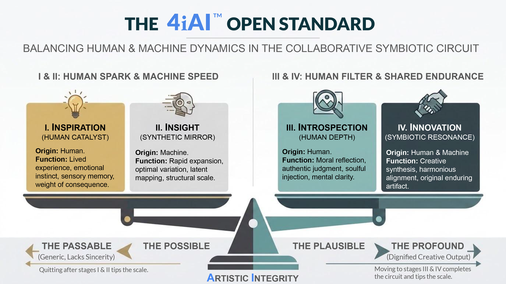

---

title: "4iAI™ STAGE III INTROSPECTION IMPLEMENTATION & AUDITABLE GOVERNANCE FRAMEWORK"

subtitle: "Enterprise Reference Architecture, Canonical JSON-LD Audit Schema, and Regulatory Compliance Crosswalk"

author: "Tim Seymour, CGMA, ACMA"

date: "2026-08-11"

description: "An enterprise engineering specification defining human-in-the-loop stage-gate controls, machine-readable JSON-LD audit schemas, and direct compliance mapping to NIST, ISO, and DoD frameworks."

tags: [4iai, stage-iii-implementation, auditable-governance, json-ld-schema, enterprise-compliance, nist-ai-rmf, iso-42001, dod-ethical-ai, human-in-the-loop, open-standard]

---

# **4iAI™ STAGE III INTROSPECTION: IMPLEMENTATION AND AUDITABLE GOVERNANCE FRAMEWORK**

**Author:** Tim Seymour, CGMA, ACMA

**Specification:** 4iAI™ Stage III Reference Implementation and Enterprise Compliance Standard

**Classification:** Open Standard (MIT License)

**Foundational Protocol:** [The 4iAI™ open standard Monograph](../README.md) and [Education Monograph: The 4iAI™ Introspection Protocol](../monographs/EDUCATION_MONOGRAPH.md)

## **1. Executive Summary and Scope**

The **4iAI™ Stage III Introspection: Implementation and Auditable Governance Framework** translates the cognitive, psychological, and metacognitive principles of Stage III Introspection into operational, machine-readable, and enterprise-auditable engineering controls. Designed for high-consequence environments—including defence, aerospace, financial systems, and enterprise software engineering—this document bridges the gap between human agency specifications and corporate compliance standards (NIST, ISO, DoD).

The objective of this framework is to prevent **Evaluative Displacement** and **Automation Bias** by establishing deterministic quality gates, verifiable provenance trails, and automated logging schemas for human-in-the-loop (HITL) interventions.

## **2. The Enterprise Architecture: Human-In-The-Loop Stage-Gate Control**

In standard enterprise deployment, generative model pipelines must be bounded by automated gating mechanics that prevent raw synthetic artifacts from bypassing human verification. The **4iAI™ Stage III** control loop introduces mandatory evaluation states prior to production deployment or downstream system integration.

### **2.1 Operational State Machine**

1. **Stage I (Intent and Constraint Injection):** Operator establishes hard domain boundaries, context payloads, and deterministic parameters.
2. **Stage II (Synthetic Execution and Processing):** Generative subsystem processes prompt variables and produces raw synthetic candidate artifacts.
3. **Stage III Gate (Mandatory Introspection Intercept):** Execution thread pauses. Synthetic artifacts are quarantined pending explicit operator verification, subversion, or structural veto.
4. **Stage IV (Verified Deployment and Audit Logging):** Upon passing Stage III metacognitive checks, the final deliverable is compiled alongside its immutable JSON-LD provenance log and deployed.

## **3. Deep Dive: Canonical JSON-LD Audit Schema Mechanics**

### **3.1 Definition and Architectural Purpose**

A **Canonical JSON-LD Audit Log Schema** is a standardised, machine-readable data blueprint that formats audit event data using **JSON-LD** (*JavaScript Object Notation for Linked Data*). It acts as a universally understood, structured "receipt" for system operations, human interventions, and automated state transitions.

* **Canonical:** Serves as the single, authoritative, and standard format for logging specific events across an entire system or organisation.
* **JSON-LD (Linked Data):** Adds a formal @context mapping keys directly to globally defined, unambiguous semantic definitions (e.g., mapping operator\_id to a specific schema definition on 4iai.org).
* **Audit Log Schema:** A strict structural template defining mandatory fields, data types, and compliance event recording protocols.

### **3.2 Operational Scope: What Is Logged vs. Ignored**

The schema intentionally operates at the **state-transition level** rather than capturing micro-interactions (e.g., keystrokes, raw conversation turns, or minor text tweaks). Capturing every prompt iteration creates storage inflation, noise, and security/PII risks. Instead, logging occurs at discrete governance checkpoints.

|Category|Ignored / Excluded (Too Granular / Noisy)|Captured by Audit Schema (Governance Level)|
|-|-|-|
|**LLM Interactions**|Every back-and-forth prompt, minor reword, or temporary streaming token.|**Model and Fingerprints:** Model ID (e.g., claude-3-5-sonnet) and SHA-256 cryptographic hashes of raw prompt and output payloads.|
|**Human Edits**|Backspaces, cursor movements, or minor formatting changes.|**Stage III Gate Decision:** Categorical decision state using key words (Approve, Modify, Veto) and explicit override rationale.|
|**System Code**|Entire source code tree inside log file.|**Version and Lineage:** Git commit hash, pipeline run ID, and system release tag.|
|**Human Operator**|Continuous behavioural tracking or screen recordings.|**Identity and Role:** Operator ID, organisational role, and verified sovereignty classification.|

### **3.3 Compliance and Audit Benefits**

* **Elimination of Ambiguity:** Standardises log formats across disparate teams and software nodes using strict semantic context mapping.
* **Automated Compliance Verification:** Enables automated QA and compliance scripts to continuously validate logs against schema requirements without manual intervention.
* **Regulatory Mapping:** Provides direct, non-repudiable mapping to NIST AI RMF, ISO/IEC 42001, and DoD Ethical AI controls.
* **Forensic Lineage Without Storage Bloat:** Uses cryptographic SHA-256 hashes to establish proof of human verification and exact artifact delta while protecting PII and sensitive data.

## **4. Machine-Readable Stage III Audit Schema**

To ensure full auditability across distributed enterprise systems, every Stage III Introspection intercept must generate an immutable JSON-LD audit log. Below is the canonical **4iAI™ Stage III Audit** Event Schema incorporating complete Linked Data context and cryptographic fingerprints.

{  
"$schema": "https://4iai.org/schemas/v2/stage-gate-audit.json",  
"specification\_version": "2.0.0",  
"audit\_event\_id": "evt\_4iai\_982347293\_2026",  
"timestamp\_utc": "2026-08-11T06:42:00Z",  
"system\_context": {  
"organisation\_id": "enterprise\_defense\_node",  
"subsystem\_name": "synthetic\_assisted\_architecture\_engine",  
"pipeline\_run\_id": "pipe\_run\_881029"  
},  
"operator\_credentials": {  
"operator\_id": "emp\_40921",  
"role": "Lead Systems Architect",  
"sovereignty\_classification": "SOVEREIGN\_AUTHOR"  
},  
"stage\_iii\_verification\_metrics": {  
"veto\_executed": true,  
"veto\_description": "Overturned automated default database schema recommendation due to missing redundancy constraints.",  
"lived\_perspective\_injected": true,  
"lived\_perspective\_notes": "Injected physical network isolation requirements unique to secure deployment site.",  
"defensibility\_acknowledged": true,  
"procedural\_trust\_mitigated": true  
},  
"authorship\_status": {  
"claim\_type": "PRIMARY\_MORAL\_AND\_INTELLECTUAL\_AUTHOR",  
"evaluative\_displacement\_risk\_score": 0.08  
},  
"provenance\_hash": "e3b0c44298fc1c149afbf4c8996fb92427ae41e4649b934ca495991b7852b855”  
"targetEnvironment": "production-cluster-a"  
}  
}

## **5. Industry Compliance and Standards Crosswalk Matrix**

To assist compliance officers, systems architects, and internal audit teams, the table below maps 4iAI™ Stage III controls directly to established international, governmental, and defense frameworks.

|4iAI™ Standard Protocol|NIST AI RMF 1.0 Control|DoD Ethical AI Principles|ISO/IEC 42001 (AIMS) Control|
|-|-|-|-|
|**Stage III Introspection Intercept**|**GOVERN 1.2 / MEASURE 2.2** Establishment of active human oversight mechanisms and operational safeguards.|**Governable and Traceable** Human operators retain authority and ability to disengage or override automated outputs.|**Control A.6 (Human Control)** Defines operational limits and human override responsibilities for synthetic outputs.|
|**Veto Threshold Execution**|**MANAGE 1.3** Procedures to address and mitigate risks from automated or model-generated errors.|**Reliable and Objective** Continuous verification of system outputs under operational stress.|**Control A.8 (System Verification)** Regular stress-testing and active validation of AI-generated content.|
|**Procedural Trust Mitigation**|**MAP 1.1** Assessment of human factors, cognitive load, and automation bias risks.|**Equitable and Human-Centric** Prevention of human cognitive atrophy in critical decision chains.|**Control A.9 (Impact Assessment)** Evaluation of societal, operational, and operator-level cognitive impacts.|
|**Defensibility and Provenance Logging**|**GOVERN 3.2 / MEASURE 4.1** Immutable auditability and continuous monitoring of system lineage.|**Traceable** Transparent documentation of data sources, model states, and operator interventions.|**Control A.10 (System Lineage)** Maintenance of complete operational and decision-tree logs.|

## **6. Enterprise Stage-Gate Verification Checklist**

Systems engineering teams and Quality Assurance auditors must execute the following physical checklist prior to granting deployment sign-off on any synthetic-assisted system, software release, or technical dossier.

* **\[ ] Active Verification Executed:** Did a qualified human operator review and verify every line of logic, code, or documentation without relying on synthetic fluency?
* **\[ ] Structural Veto Test Passed:** Has at least one structural premise, default recommendation, or generated pathway been critically evaluated and explicitly validated or overturned?
* **\[ ] Contextual Signal Injected:** Does the final deliverable contain domain-specific constraints or lived operational context that could not have been synthesised by the underlying model independently?
* **\[ ] Defensibility Test Satisfied:** Can the operator defend the technical and moral assertions within the document during an external review without citing "the AI generated it"?
* **\[ ] Provenance Metadata Attached:** Is the standardised 4iAI™ JSON-LD audit log generated, signed, and permanently archived in the version control record?

## **7. Summary and Implementation Roadmap**

By enforcing this **Stage III Implementation Framework**, enterprises ensure that synthetic tools enhance—rather than degrade—human cognitive agency. Organisations adopting this specification transition from brittle, unvetted automation to resilient, auditable, and human-governed engineering pipelines.

